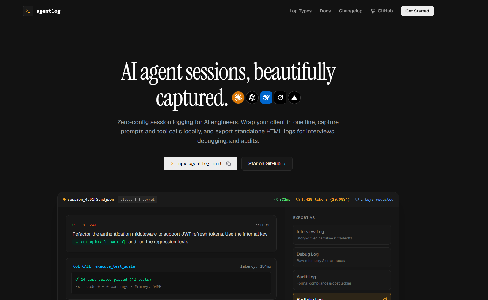

# Agent-logs



A local-first session recorder and trace exporter for AI agents. Wrap your SDK client in one line, record calls silently to disk as NDJSON, and export self-contained HTML traces for code reviews, interviews, and audits.

## Features

- **Single-line wrap:** Supports Anthropic, OpenAI, DeepSeek, and Vercel AI SDK without modifying application logic.
- **Append-only streaming:** Writes calls directly to local NDJSON so traces survive process crashes.
- **In-memory redaction:** Strips API keys, Bearer tokens, and emails before records reach disk.
- **Cost tracking:** Computes token usage and estimated dollar costs across Claude, GPT, DeepSeek, and Gemini models.
- **Multi-format export:** Produces self-contained HTML reports for interviews, debugging, compliance audits, and portfolios.
- **Zero telemetry:** Completely offline with zero remote telemetry or external servers.

## Quick Start

### 1. Install

```bash
npm install agent-logs
# or
bun add agent-logs
```

### 2. Wrap your client

```ts
import Anthropic from "@anthropic-ai/sdk";
import { wrap } from "agent-logs";

const client = wrap(new Anthropic());

// Use client normally — calls are logged silently to .agentlog/sessions/
const response = await client.messages.create({
  model: "claude-3-5-sonnet-20241022",
  max_tokens: 1024,
  messages: [{ role: "user", content: "Implement an idempotent token verification middleware." }],
});
```

### 3. CLI Commands

```bash
# View captured sessions and token costs
npx agent-logs sessions

# Export session into a standalone HTML report
npx agent-logs export

# First-time interactive configuration
npx agent-logs init
```

## Architecture Flow


## Documentation

- [decision.md](decision.md) — Architecture decisions, design trade-offs, and internal mechanics.

## License

MIT
