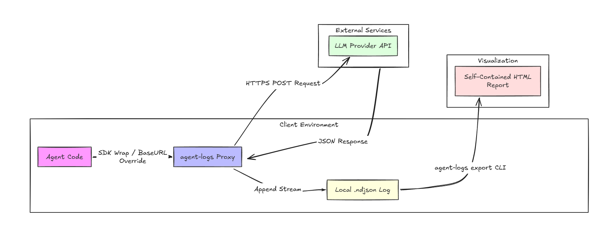

# agent-logs


Log AI agent sessions locally. Wrap your client in one line, record prompts and tool calls in the background, and export shareable HTML reports.

## Features

- **One-line setup:** Works with Anthropic, OpenAI, DeepSeek, and Vercel AI SDK.
- **Crash-safe:** Saves each call immediately to disk so you never lose data if your script crashes.
- **Automatic secret redaction:** Removes API keys, tokens, and emails before anything is saved.
- **Cost tracking:** Estimates token usage and costs for Claude, GPT, DeepSeek, and Gemini models.
- **Standalone HTML exports:** Generates clean, interactive reports you can open in any browser or share with teammates.
- **100% local:** No accounts, no cloud setup, and no telemetry.

## Quick Start

### 1. Install

```bash
npm install agent-logs
# or
bun add agent-logs
```

### 2. Wrap your client

```ts
import Anthropic from "@anthropic-ai/sdk";
import { wrap } from "agent-logs";

const client = wrap(new Anthropic());

// Use client normally — calls are saved automatically to .agentlog/sessions/
const response = await client.messages.create({
  model: "claude-3-5-sonnet-20241022",
  max_tokens: 1024,
  messages: [{ role: "user", content: "Implement an idempotent token verification middleware." }],
});
```

### 3. CLI Commands

```bash
# View captured sessions and token costs
npx agent-logs sessions

# Export session into a standalone HTML report
npx agent-logs export

# First-time interactive configuration
npx agent-logs init
```

## Architecture Flow



## Documentation

- [decision.md](decision.md) — Architecture decisions, design trade-offs, and internal mechanics.
- [instruction.md](instruction.md) — Guide for building, publishing to npm, and CLI command options.

## License

MIT
