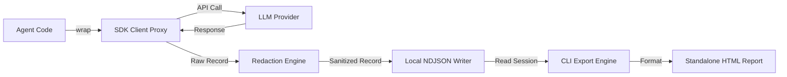

# agentlog

A zero-overhead, local-first capture and export tool for AI agent sessions. Wrap your client in one line, record calls silently to disk, and export self-contained HTML traces for code reviews, interviews, and audits.

<!-- Replace with landing page screenshot or demo video -->


---

## What it is

agentlog records multi-turn LLM interactions directly on your local machine. It intercepts SDK network calls, redacts secrets in memory, and writes append-only newline-delimited JSON logs to `.agentlog/sessions/`.

When you want to share your agent's reasoning, run the CLI export command. agentlog formats the session into a single, standalone HTML file with embedded styling and interaction logic. No external server, no account setup, and no telemetry.

---

## Key features

- **Single-line client wrap:** Works with Anthropic, OpenAI, DeepSeek, Grok, and Vercel AI SDK without changing your application logic.
- **Append-only streaming:** Each call writes to disk immediately. If your agent process crashes, prior calls remain intact.
- **In-memory redaction:** Strips API keys, Bearer tokens, and email addresses before records reach persistent storage.
- **Token cost tracking:** Computes token usage and estimated dollar costs across Claude, GPT, DeepSeek, and Gemini models.
- **Targeted export types:** Produces four distinct output formats: `interview` (narrative reasoning), `debug` (dense telemetry), `audit` (model and cost ledger), and `portfolio` (outcome-focused).
- **Self-contained HTML:** Exports require no runtime dependencies, external CDNs, or remote assets. Open them directly in any browser.

---

## Architecture



For complete architecture details, schemas, and trade-off analyses, read [decision.md](decision.md).

---

## Monorepo layout

This repository is managed with Bun workspaces:

```
agentlog/
├── packages/
│   └── agentlog/         # Core TypeScript library and CLI tool
├── apps/
│   └── web/              # Static Next.js landing page and documentation
├── assets/               # Visual brand assets and provider logos
├── decision.md           # Architecture design document and decision log
└── README.md
```

---

## Installation

To add the package to your project, run:

```bash
bun add agentlog
# or
npm install agentlog
```

Provider SDKs (`@anthropic-ai/sdk`, `openai`) are optional peer dependencies. Install only the SDKs your application uses.

---

## Usage

### 1. Wrap your client

Wrap your existing client instance. Types and method signatures stay identical:

```ts
import Anthropic from "@anthropic-ai/sdk";
import { wrap } from "agentlog";

const client = wrap(new Anthropic());

// Run calls as normal
const response = await client.messages.create({
  model: "claude-3-5-sonnet-20241022",
  max_tokens: 1024,
  messages: [{ role: "user", content: "Write an idempotent database migration." }],
});
```

For OpenAI or compatible endpoints (such as DeepSeek):

```ts
import OpenAI from "openai";
import { wrap } from "agentlog";

const client = wrap(
  new OpenAI({
    baseURL: "https://api.deepseek.com",
    apiKey: process.env.DEEPSEEK_API_KEY,
  })
);
```

### 2. Inspect captured sessions

To view all recorded sessions in your terminal, run:

```bash
npx agentlog sessions
```

This outputs a table showing session IDs, start times, model versions, turn counts, total tokens, and estimated costs.

### 3. Export a report

To generate an HTML trace report, run:

```bash
npx agentlog export
```

The CLI displays an interactive prompt to select the session and export type. It compiles the output into `./agentlog-exports/<session-id>-<type>.html`.

To run non-interactively in automated scripts, supply the flags directly:

```bash
npx agentlog export --session <session-id> --type interview --output ./report.html
```

---

## How it works

1. **Proxy interception:** `wrap(client)` returns a wrapped client instance. When your application calls completion methods, the wrapper records timestamps, model parameters, and input messages.
2. **In-memory scrubbing:** The payload passes through regex cleaners that replace detected credentials, authorization headers, and emails with redaction placeholders.
3. **Sequential write:** The sanitized record is appended to `.agentlog/sessions/<session-id>.ndjson` using synchronous file appends.
4. **Offline generation:** When you run `agentlog export`, the CLI reads the session file, optionally requests a narrative synthesis from your configured model, and injects the result into an inlined HTML template.

---

## Development and testing

To run tests across all packages:

```bash
bun test
```

To build both the NPM package and the documentation web application:

```bash
bun run build
```

To start the documentation web application locally:

```bash
cd apps/web
bun run dev
```

---

## License

MIT
