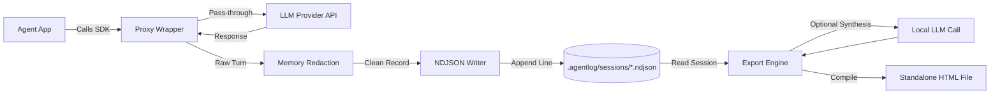

# Architecture Decisions and Internals Reference

This document covers the core architecture, key design decisions, and internal mechanics of agentlog. Use it as a quick reference when contributing to or debugging the codebase.

---

## System Overview

agentlog is an offline-first session recorder and exporter for AI agents. It captures prompts, tool calls, and token usage locally, redacts secrets in memory, and formats traces into standalone HTML reports without requiring external servers.

### Internal Data Flow



---

## How the Internals Work

### 1. Client Interception (`packages/agentlog/src/adapters/`)
- `wrap(client)` inspects the incoming client object to detect Anthropic (`client.messages.create`) or OpenAI-compatible shapes (`client.chat.completions.create`).
- It wraps the target completion method using a lightweight Proxy.
- Before delegating to the native SDK, the wrapper starts a high-resolution timer.
- On return (or throw), it extracts input messages, tool parameters, stop reasons, and token counts, normalizes them into a unified `Call` shape, and hands them to the session writer.

### 2. Redaction Engine (`packages/agentlog/src/capture/redact.ts`)
- Runs synchronously in memory before any data is passed to the filesystem.
- Traverses string primitives, objects, and arrays up to a safe depth limit.
- Replaces matches for known secret patterns (OpenAI keys, Anthropic keys, GitHub tokens, Bearer headers, and emails) with static redaction tokens like `[REDACTED_API_KEY]`.
- Guarantees that raw credentials never reach persistent storage on disk.

### 3. Session Persistence (`packages/agentlog/src/capture/writer.ts`)
- Stores each session as an append-only newline-delimited JSON (`.ndjson`) file in `.agentlog/sessions/<session-id>.ndjson`.
- Line 1 is a `SessionHeader` record with session ID, start timestamp, provider, and model name.
- Subsequent lines are individual `SessionCallRecord` entries appended immediately as each LLM turn finishes.
- If an agent process crashes or is terminated mid-run, all previously completed calls remain intact and readable.

### 4. Cost Engine (`packages/agentlog/src/costs.ts`)
- Maintains per-million token pricing tables for Claude, GPT, DeepSeek, and Gemini models.
- Resolves model identifiers using exact matches first, followed by prefix matching.
- If a model identifier is unknown or custom, it returns `null` instead of throwing, allowing execution to continue safely.

### 5. Export and Templating (`packages/agentlog/src/export/`)
- The CLI (`agentlog export`) reads the target session's `.ndjson` file.
- It routes to one of four output types: `interview` (narrative focus), `debug` (dense timeline and latency), `audit` (token and cost ledger), or `portfolio` (high-level showcase).
- If the developer has an API key configured, it runs a single synthesis call to generate high-level summaries and takeaways. If no key is present, it falls back to raw structured timeline rendering.
- Inlines all CSS, SVG icons, and JavaScript into a single HTML file. The output has zero CDN dependencies and opens offline in any browser.

---

## Key Decisions and Trade-offs

### Append-Only Local NDJSON vs. Embedded Database (SQLite)
- **Decision:** Use flat `.ndjson` files in `.agentlog/sessions/`.
- **Reasoning:** Zero binary dependencies (no `node-gyp` or native bindings to compile on different operating systems). Newline-delimited files stream cleanly with synchronous file appends.
- **Trade-off:** Querying across hundreds of sessions requires reading directory files rather than running SQL queries. This is acceptable because sessions are inspected individually or in small batches.

### Proxy Wrapping vs. Monkey-Patching `globalThis.fetch`
- **Decision:** Require developers to call `wrap(client)`.
- **Reasoning:** Global fetch patching introduces hidden side effects into unrelated network calls (database connections, internal APIs, webhooks). Explicit proxying preserves TypeScript types and makes recording predictable.
- **Trade-off:** Requires a one-line code modification during client setup instead of ambient zero-code process hooking.

### Client-Side Synthesis vs. Hosted Cloud Ingestion
- **Decision:** Run trace summarization directly on the developer's machine using their existing API keys.
- **Reasoning:** Eliminates backend hosting costs, authentication infrastructure, and user databases. Trace data and source code remain on the developer's machine, satisfying corporate confidentiality requirements.
- **Trade-off:** Narrative report generation requires a valid API key in the developer's local environment.

### Single-File HTML Reports vs. Web Dashboard
- **Decision:** Compile exports into self-contained `.html` files.
- **Reasoning:** Developers need artifacts they can attach to pull requests, drop into Slack channels, email to reviewers, or view offline. A standalone file requires no hosting or account setup.
- **Trade-off:** Does not support real-time shared editing or live collaborative annotations.

### Optional Peer Dependencies for Provider SDKs
- **Decision:** Mark `@anthropic-ai/sdk` and `openai` as optional peer dependencies.
- **Reasoning:** Keeps package install size small. A project using only Anthropic does not install OpenAI SDK packages or transitive dependencies.
- **Trade-off:** Adapter implementations must rely on structural duck-typing (`client.messages` vs. `client.chat.completions`) rather than strict compile-time SDK imports.

---

## File Format Reference

Each `.ndjson` file contains two record types:

### Line 1: Header Record
```json
{
  "type": "header",
  "id": "a1b2c3d4",
  "startedAt": "2026-09-13T10:15:30.120Z",
  "provider": "anthropic",
  "model": "claude-3-5-sonnet-20241022",
  "title": "refactor-auth-flow",
  "metadata": {}
}
```

### Lines 2+: Call Record
```json
{
  "type": "call",
  "call": {
    "id": "call_01",
    "timestamp": "2026-09-13T10:15:32.400Z",
    "durationMs": 1420,
    "input": {
      "system": "You are a code refactoring agent.",
      "messages": [{ "role": "user", "content": "Update token verification logic." }],
      "tools": []
    },
    "output": {
      "content": [{ "type": "text", "text": "Token verification updated." }],
      "stopReason": "end_turn",
      "usage": { "promptTokens": 450, "completionTokens": 80, "totalTokens": 530 }
    },
    "metadata": {
      "costEstimate": 0.0025
    }
  }
}
```
